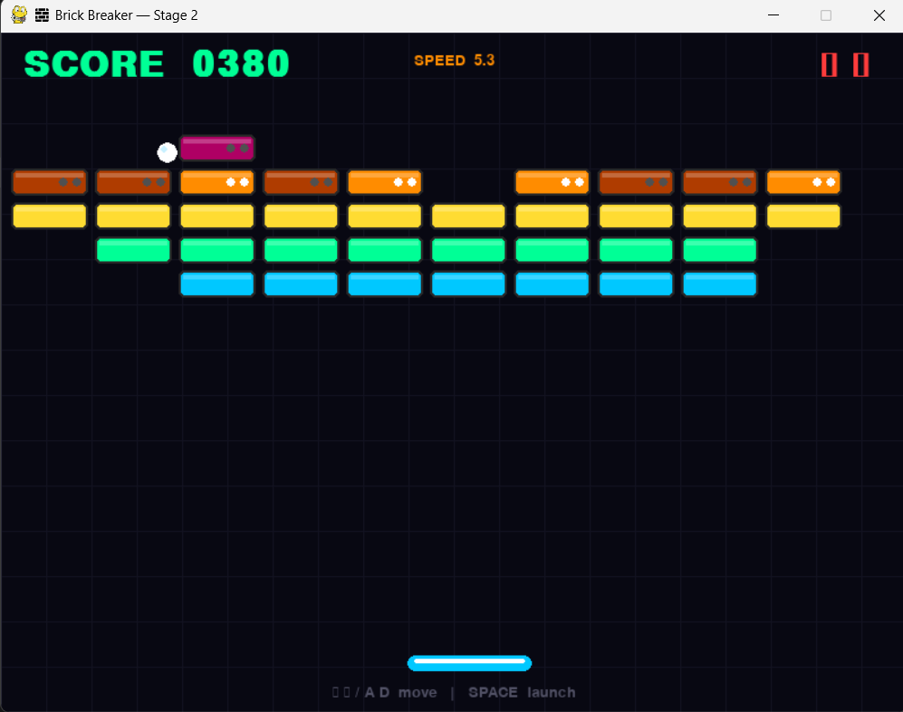

# 🧱 Brick Breaker Game


> A classic brick-breaker rebuilt in Python and pygame — neon dark-theme, 2-HP brick system, angle physics, particle engine, sound feedback, and a fully balanced power-up system with timed effects and live HUD indicators.

---

## 📸 Preview

<p align="center">
  
</p>

---

## 🆕 What's New in V1.4

> V1.4 is the **power-up optimization update** — timed effects, drop balancing, stack control, and crash fixes on top of V1.3's power-up foundation.

| # | Feature | Details |
|---|---|---|
| ⏱️ | **Timed Power-Up Effects** | Expand lasts 8s, Slow lasts 6s — both expire automatically |
| 🕐 | **Active Timer Tracking** | `expand_timer` and `slow_timer` track remaining duration live |
| 📏 | **Max Paddle Width Cap** | Prevents infinite expansion from stacking multiple Expand pickups |
| 🐢 | **Min Ball Speed Floor** | Prevents ball from becoming uncatchably slow after repeated Slow pickups |
| ⚖️ | **Weighted Drop Rates** | Expand 12% · Slow 8% · Extra Life 5% — balanced for fairness |
| 🔁 | **Stack Control** | Collecting the same power-up refreshes its timer instead of stacking endlessly |
| 📊 | **Live HUD Indicators** | Active power-up names and remaining duration shown on screen |
| 🐛 | **Crash Fix** | Fixed game crash when Slow power-up expired — ball speed now resets cleanly |

---

## 📋 Full Version History

| Version | Theme | Highlights |
|---|---|---|
| **V1.0** | Base Game | 2-HP bricks, speed scaling, angle physics, neon UI, HUD, state machine |
| **V1.1** | Sound System | `pygame.mixer` integration, 4 `.wav` files (paddle, brick, lose, win) |
| **V1.2** | Visual Polish | Particle engine — ball trail, paddle sparks, brick explosions + constants refactor |
| **V1.3** | Gameplay Expansion | Modular `powerup.py`, 3 power-up types, falling collectibles, color-coded rendering |
| **V1.4** | Gameplay Optimization | Timed effects, drop balancing, stack control, HUD indicators, crash fix |

---

## ⚡ Power-Up System

### Power-Up Types

| Power-Up | Color | Drop Rate | Effect | Duration |
|---|---|---|---|---|
| 🟢 **Expand Paddle** | Green | 12% | Increases paddle width for easier catches | 8 seconds |
| 🔵 **Slow Ball** | Blue | 8% | Reduces ball speed for better control | 6 seconds |
| 🔴 **Extra Life** | Red | 5% | Grants one additional life | Permanent |

### How It Works

```
Brick destroyed
    │
    ├── Random roll against drop rates (12% / 8% / 5%)
    │
    ├── Power-up spawns at brick position, falls downward
    │
    └── Paddle collision → effect applied
            │
            ├── Expand / Slow → timer starts (or refreshes if already active)
            └── Extra Life → lives + 1 (permanent)
```

### Timer & Stack Control
- **Expand** and **Slow** are timed — they expire after their duration
- Picking up the **same power-up while active refreshes the timer** — no infinite stacking
- **Max paddle width** caps Expand to prevent the paddle from filling the entire screen
- **Min ball speed** floors Slow to keep the ball always catchable
- Expiry is handled cleanly — the Slow crash bug from V1.3 is fixed

---

## ✨ Full Feature Set

| Feature | Description |
|---|---|
| ⚡ **Power-Up System** | 3 types — Expand, Slow, Extra Life — with timed effects and balanced drop rates |
| ✨ **Particle Engine** | Ball trail, paddle sparks, and brick explosion effects |
| 🟥 **2-HP Brick System** | Top 3 rows take 2 hits — darken on first hit, show dot HP indicators |
| 💥 **1-HP Bricks** | Bottom 3 rows shatter in a single hit |
| ⚡ **Dynamic Speed Scaling** | Ball speeds up every 5 destroyed bricks |
| 🎮 **Angle Physics** | Paddle hit offset influences ball bounce angle |
| 🏆 **Scoring** | +10 for destroyed bricks, +5 for hitting a 2-HP brick |
| ❤️ **3 Lives** | Ball falling below screen costs one life |
| 🎨 **Neon Dark UI** | Dark grid background, neon-colored bricks with shine strips |
| 📊 **Live HUD** | Score, lives, ball speed, and active power-up timers |
| 🔊 **Sound Feedback** | Sounds on paddle hit, brick destroy, life lost, and win |
| 🪟 **State Machine** | Clean `playing → lost_life → game_over / won` transitions |

---

## 🗂️ Project Structure

```
brick-breaker-game/
│
├── main.py              # 🚀 Entry point — runs Game()
├── settings.py          # ⚙️  All constants, power-up config, timers
├── requirements.txt     # 📦 Dependencies
├── .gitignore
├── README.md
├── LICENSE
│
├── game/
│   ├── __init__.py
│   ├── game.py          # 🧠 Game loop, state machine, HUD, power-up integration
│   ├── ball.py          # ⚽ Velocity, bounce, speed scaling, trail particles
│   ├── paddle.py        # 🏓 Movement, width control, spark particles
│   ├── brick.py         # 🧱 HP logic, darkening, dot indicators, explosion particles
│   └── powerup.py       # ⚡ Power-up types, falling mechanic, timer system
│
├── sounds/
│   ├── paddle.wav
│   ├── brick.wav
│   ├── lose.wav
│   └── win.wav
│
├── screenshots/
│   └── V1.0.png
│
└── assets/               # 🔮 Future — boss sprites, level maps
```

---

## 🛠️ Tech Stack

| Layer | Technology | Purpose |
|---|---|---|
| **Language** | Python 3.10+ | Core game logic |
| **Game Engine** | [pygame](https://www.pygame.org/) | Rendering, event loop, input, audio |
| **Power-Ups** | `powerup.py` (modular) | Drop logic, collision, timed effects, stack control |
| **Particles** | Custom particle system | Trail, spark, and explosion effects |
| **Audio** | `pygame.mixer.Sound` | `.wav` playback for all game events |
| **Config** | `settings.py` | All constants unified — timers, drop rates, limits |

---

## 🎮 Controls

| Key | Action |
|---|---|
| `← / A` | Move paddle left |
| `→ / D` | Move paddle right |
| `SPACE` | Launch ball / continue after life loss |
| `R` | Restart after win or game over |
| `ESC` | Quit |

---

## 🧱 Brick Grid

**6 rows × 10 columns = 60 bricks**

| Row | Color | HP | Notes |
|---|---|---|---|
| 1 | 🔴 Red | 2 | Darkens on first hit, dot indicator |
| 2 | 🩷 Pink | 2 | Darkens on first hit, dot indicator |
| 3 | 🟠 Orange | 2 | Darkens on first hit, dot indicator |
| 4 | 🟡 Yellow | 1 | One-hit destroy |
| 5 | 🟢 Neon Green | 1 | One-hit destroy |
| 6 | 🔵 Neon Blue | 1 | One-hit destroy |

---

## 🏆 Scoring

| Event | Points |
|---|---|
| Brick destroyed | +10 |
| 2-HP brick hit but not destroyed | +5 |

---

## ⚙️ Setup & Installation

```bash
git clone https://github.com/caffineblud/Brick-Breaker-Game.git
cd Brick-Breaker-Game
pip install -r requirements.txt
python main.py
```

---

## 🔮 Planned for V1.5+

- [ ] 🏆 High score persistence (`scores.json`)
- [ ] 🗺️ Multiple levels with increasing difficulty
- [ ] 👾 Boss brick / special stages
- [ ] 🔫 Laser power-up (paddle fires projectiles)
- [ ] 🌀 Multi-ball power-up

---

## 👨‍💻 Author

**Yash Kumar Singh**

[](https://github.com/caffineblud)

⭐ If you like this project, consider giving it a star.